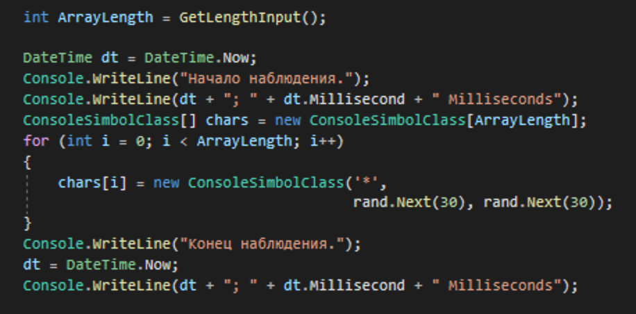
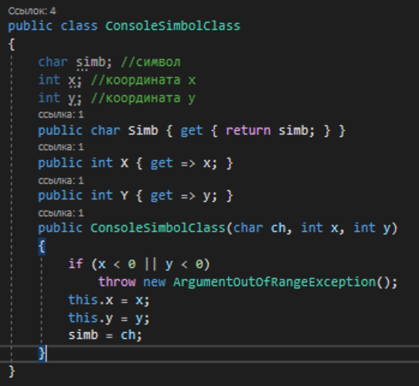
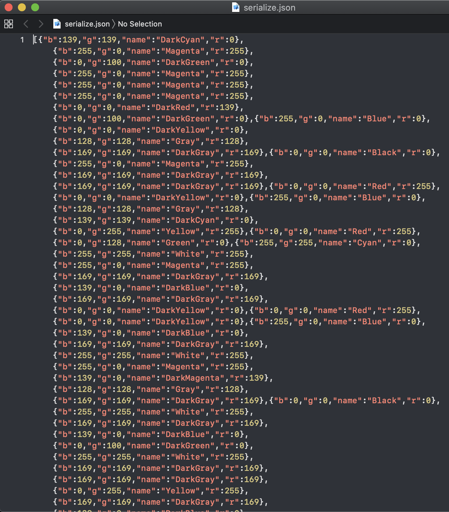
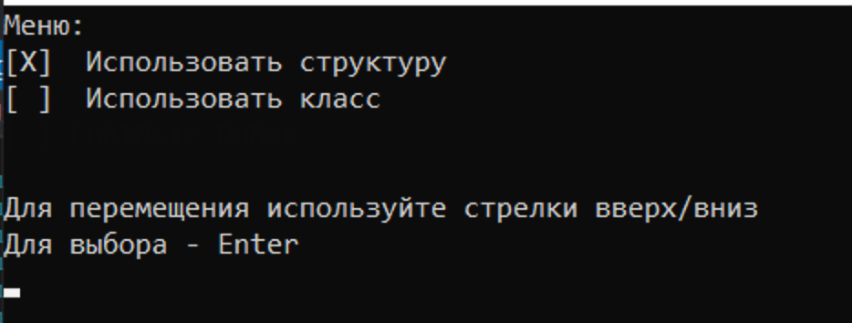
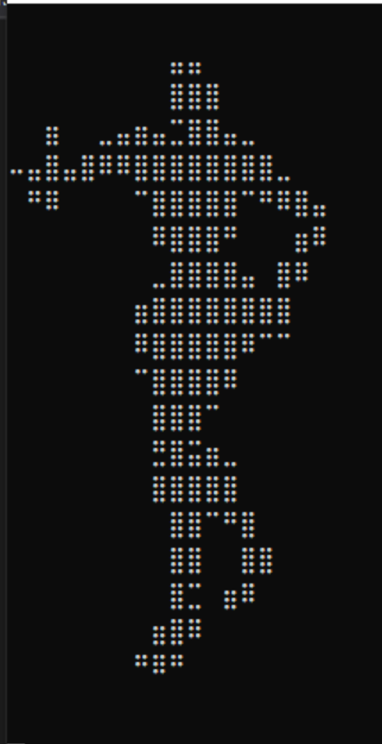
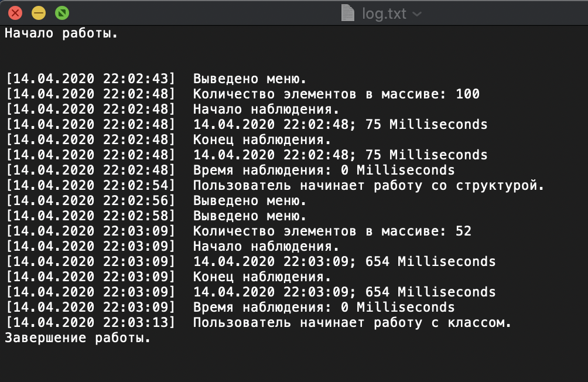

# Introduction to JSON Serialization
Small project-presentation as a training activity (1.04.2020) (DISCIPLINE: Programming; Faculty Of Computer Science)

This project is created for an illustration of working with such serialization type like JSON-serialization.

## Setup

### Install

Manually install 
[ZIP](https://github.com/S-TooManyQuestions-S/Introduction-to-JSONSerialization/archive/master.zip).

### Run the program

* Run TeamWorkT3.sln with your Visual Studio or Rider
* Use the Run Button to run the project

## Functionality

### First Main Task

Use DateTime class instead of StopWatch

### Second Main Task
1. Add class ConsoleSimbolClass identical to ConsoleSimbolStruct.

2. In Program.cs repeat procedure of object creating using class instead of struct.
You can choose what do you want to use (class or struct) from our menu.

3. Take measurement of time. Take results to output.
We are noting elapsed time in both of UseClass and UseStruct methods.

4. Save color`s names and R-G-B values using JSON format.

### Extra Tasks

1. CoOl Menu

2. Added Console Fortnite Dancer

3. Added simple logging

### **(All Rights reserved)**
* **Developer Team**
  * https://github.com/TopYar 
  * https://github.com/RinokuS
  * https://github.com/S-TooManyQuestions-S
  * https://github.com/andrewkir
  
 (Using Microsoft Visual Studio Live Share)
